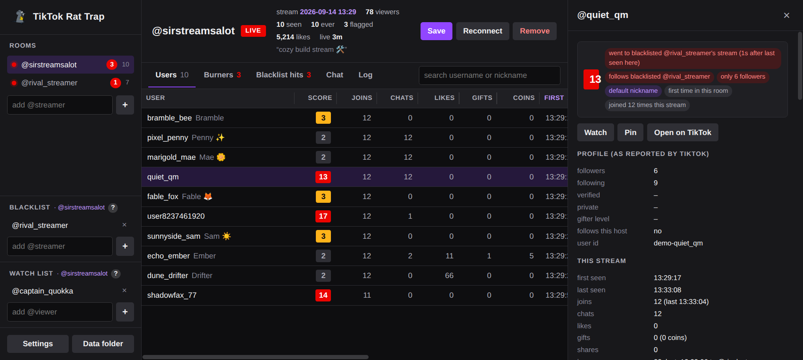
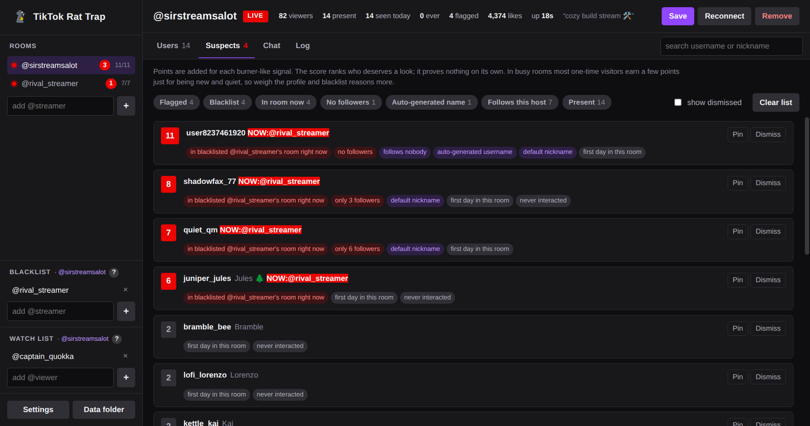

# TikTok Rat Trap

A trap for the rats in your TikTok LIVE room. Rat Trap watches who comes in, remembers them across
streams, and points out accounts that look like throwaways: brand-new profiles, zero followers,
auto-generated names, drive-by visits, renamed accounts, and viewers who follow streamers you
have blacklisted. It exists to help a streamer work out which accounts are likely burners used
to file bogus abuse reports.

TikTok Rat Trap is an Electron desktop app with a Twitch-style dark interface.





*Screenshots use demo mode (`RATTRAP_DEMO=1 npm start`), which plays back invented activity
with made-up names so no real viewers are shown.*

```sh
npm install
npm start                        # opens the rooms saved in config.json
npm start -- someone_else        # also open @someone_else for this session only
npm test
```

## The app

- **Rooms** (sidebar): every streamer being monitored, with a status dot (red = live, yellow =
  waiting for them to go live, purple = connecting) and present/seen counts. Add a room with the
  box below the list. Rooms added here are remembered in `config.json`.
- **Blacklist** and **Watch list** (sidebar): one pair per room, edited in place, saved immediately.
- **Users** tab: everyone seen today (only the rows in view are drawn, so large rooms stay quick). Click a column to sort, drag a header edge to resize it
  (double-click the edge to reset; widths are remembered), type to search, tick "present only".
  Long names are cut with an ellipsis; hover to see the full name. Click a row for the drawer.
- **Suspects** tab: today's users ranked by burner score with the reasons spelled out. Tag chips
  filter the list (flagged, blacklist hits, in another room now, renamed, no followers, watched,
  pinned…). **Pin** an account to keep it on the list; **Dismiss** hides one until it joins again;
  **Clear list** dismisses everything shown except pinned accounts. Dismissals last for the day,
  pins are remembered per room.
- **Chat** and **Log** tabs: live chat and the join/leave/gift/flag event log.
- **Detail drawer**: today's activity, TikTok-reported profile (followers, following, verified,
  private, gifter level), the room history (first seen ever, days seen, totals, previous
  usernames), other monitored rooms the account appeared in and whether it follows their host,
  and recent chat. Buttons to watch the account or open it on TikTok.
- **Toasts** pop up for flagged joins, watched users, saves and errors.
- **Settings**: idle timeout, alert score, autosave, live polling, Euler Stream API key, and
  whether to write the chat and/or the event log to text files.

If a streamer is offline the monitor waits and connects when they go live. It reconnects after
drops, marks everyone as gone when the stream ends, autosaves, and resumes today's snapshot on
restart. On connect it also replays TikTok's backlog of recent events, stamped with TikTok's own
timestamps, so people who arrived shortly before Rat Trap connected are picked up with their real
arrival time (their log lines say "before Rat Trap connected").

## What is remembered

These files live in `data/`:

- **Daily snapshots** `viewers-<room>-<date>.json`: everything seen today, including recent chat.
- **Chat and event logs** `chat-<room>-<date>.txt` and `log-<room>-<date>.txt`, one line per
  message or event, written live when the matching option is on in Settings.
- **Room history** `history-<room>.json`: one record per account ever seen in that room, keyed by
  TikTok user id, with per-day activity (joins, chats, likes, gifts, coins, shares, time in room),
  first/last seen ever, previous usernames and nicknames, follow status towards the host, and the
  latest profile details TikTok delivered.

Each room has its own history file, written only by that room's monitor, so several rooms can be
open at once without conflicts. Days are stored separately and replaced on each save, so
autosaves never double-count. A stream that runs past midnight still counts as one day.

History is kept forever by default. Set **Forget accounts not seen for N days** in Settings
(`pruneAfterDays`) to drop accounts whose last sighting in a room is older than that; pruning
runs when a room opens and on every save, and never touches pinned or watched accounts. Daily
snapshot and chat/log text files are not deleted.

## Blacklisted streamers (cross-checking rooms)

Each room has its own blacklist of streamers to cross-check against. Add the rival as a room
**and** to your room's blacklist. Then, for anyone in your room, Rat Trap checks three things and
flags them if any apply:

- **In their room right now.** Both rooms are open in the app and the same account is present
  in both. This fires an alert in your room whichever order it happens: when they join your room
  while already in the rival's, and when they walk into the rival's room while sitting in yours.
- **Follows them.** TikTok does not expose who follows whom, but every event a viewer generates
  in a room carries their follow status towards *that room's host*. While the rival is live and
  monitored, Rat Trap records which viewers follow them. This works regardless of the viewer's
  privacy settings.
- **Seen there before.** Their account appears in the rival's room history from an earlier day.

Blacklists are per room, so watching two streamers with different rivals keeps the alerts
separate. Rat Trap never scrapes anyone's following list; a follow is only learned from the
rival's own room. Other rooms' histories are re-read whenever any room saves.

## Burner score

Every account gets a transparent score. Each signal adds points and a plain-English reason.
Weights live at the top of `burner.js`:

| signal | points |
|---|---|
| follows a blacklisted streamer | 5 |
| in a blacklisted streamer's room right now | 4 |
| seen in a blacklisted streamer's room before | 2 |
| 0 followers / fewer than 10 followers | 2 / 1 |
| 0 followers and 0 following | 1 |
| auto-generated username (`user8237461920`) | 2 |
| nickname never changed from the username | 1 |
| private account | 1 |
| first day ever seen in this room | 1 |
| joined but never chatted, liked, gifted or shared | 1 |
| under 2 minutes in the room | 1 |
| 3+ joins today, still under 5 minutes total | 1 |
| seen under a different username before (same account) | 3 |

Joins that reach the alert score (`burnerAlertScore`, default 6) are announced once per run.
Higher means more burner-like signals stacked on one account. Roughly: 0 to 2 is nothing
notable, 3 to 5 is a typical first-time visitor in a busy room, 6 and up needs a profile signal
or a blacklist hit, 10 and up is several strong signals together.

The score ranks who deserves a second look. It proves nothing on its own: a shy newcomer on a
fresh account looks the same as a burner until they do something. In busy rooms TikTok samples
join and like events, so many honest viewers appear once and never again, which alone earns a
couple of points. Rely on the profile-based reasons and the blacklist, not on the lurker signals.

## Demo mode

`RATTRAP_DEMO=1 npm start` runs the app against two fictional rooms with generated joins, chat,
likes and gifts, one of which is on the other's blacklist, so every feature has something to
show. It uses a throwaway data folder and never touches `config.json`. Useful for trying the
interface without a live stream, and for screenshots.

## Building installers

```sh
npm run dist:linux     # dist/TikTok Rat Trap-<version>-linux-x86_64.AppImage
npm run dist:win       # dist/TikTok Rat Trap-<version>-setup.exe (installer) and TikTok Rat Trap-<version>-portable.exe
npm run dist           # both
```

Windows packages build on Linux too as long as `wine` is installed. The GitHub Actions workflow
in `.github/workflows/build.yml` builds both on every push to `main` and attaches them as
artifacts; pushing a tag such as `v1.0.1` also publishes them to a GitHub release.

The packages are not code-signed, so Windows SmartScreen will warn on first run
("More info" → "Run anyway"). The AppImage needs to be marked executable (`chmod +x`).

A packaged Rat Trap keeps `config.json` and the `data/` folder in the per-user app data
directory (`~/.config/TikTok Rat Trap` on Linux, `%APPDATA%\TikTok Rat Trap` on Windows); the Data folder button
opens it. Running from the repo uses the files next to the code.

## Configuration

`config.json` next to the app when running from the repo, or in the app data folder when
packaged (all keys optional; copy `config.example.json` to start). The app edits it for you.

| key                  | default                    | meaning |
|----------------------|----------------------------|---------|
| `rooms`              | `[]`                       | rooms the app opens on start; falls back to `username` |
| `username`           | `the_great_sir_stromburg`  | room opened when `rooms` is empty |
| `idleTimeoutMinutes` | `15`                       | inactivity after which a viewer is assumed gone |
| `lists`              | `{}`                       | per room: `{ "<room>": { "watch": [...], "blacklist": [...], "pinned": [...] } }` |
| `burnerAlertScore`   | `6`                        | score at which a join is announced |
| `signApiKey`         | `""`                       | optional Euler Stream API key for higher connect limits |
| `dataDir`            | `data`                     | snapshot and history directory |
| `autosaveMinutes`    | `5`                        | autosave interval, `0` to disable |
| `resume`             | `true`                     | load today's snapshot on start |
| `reconnectWhenLive`  | `true`                     | if offline, wait for the stream instead of giving up |
| `livePollSeconds`    | `60`                       | how often to check for the stream while waiting (min 30) |
| `chatHistory`        | `50`                       | recent chat messages kept per user |
| `pruneAfterDays`     | `0`                        | forget accounts not seen for this many days; `0` keeps them forever. Pinned and watched accounts are kept |
| `maxUsers`           | `10000`                    | cap on today's list per room; over it, the oldest accounts that already left are trimmed (they stay in history). `0` = unlimited |
| `chatToFile`         | `false`                    | append every chat message to `data/chat-<room>-<date>.txt` |
| `eventsToFile`       | `false`                    | append the event log to `data/log-<room>-<date>.txt` |

## Layout

| file | role |
|---|---|
| `main.js`, `preload.cjs`, `renderer/` | Electron app: main process, IPC bridge, HTML/CSS/JS interface |
| `monitor.js` | one room: connection, events, scoring, saving; no UI (also the engine the tests drive) |
| `tracker.js` | today's presence and activity per viewer |
| `history.js` | cross-day, cross-room memory |
| `burner.js` | scoring heuristics and weights |

## Accuracy

TikTok sends no "user left" event. A leave is inferred either when a user re-joins
(they must have left in between) or after the idle timeout with no chat/like/gift/share.
The recorded leave time is the last moment they were seen, so it is never later than reality.
In busy rooms TikTok samples join and like events, so not every viewer will appear until they
chat, gift, follow or share, which are always delivered. Nothing on the client side can change
that: no client sees more joins than TikTok chooses to send.

Follower counts and the other profile fields are whatever TikTok attaches to the viewer's own
events; a dash means it was never delivered. Account creation dates and bios exist in TikTok's
schema but are never filled in LIVE events (checked against real rooms), so Rat Trap does not show
or score them. Follow status towards another
streamer is only known for rooms Rat Trap has monitored.
