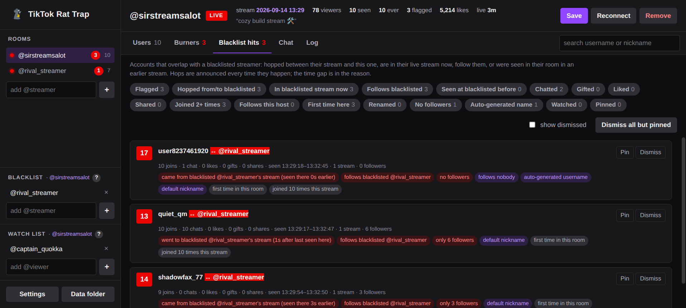
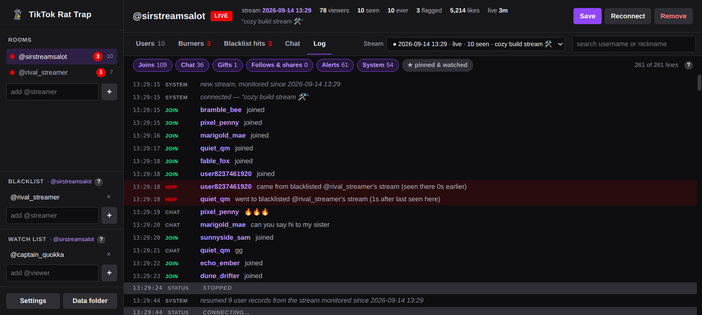

# TikTok Rat Trap

A trap for the rats in your TikTok LIVE room. Rat Trap watches who comes in, remembers them across
streams, and points out accounts that look like throwaways: brand-new profiles, zero followers,
auto-generated names, renamed accounts, and viewers who go back and forth between your room and a
streamer you have blacklisted. It exists to help a streamer work out which accounts are likely
burners used to file bogus abuse reports, and where they came from.

TikTok Rat Trap is an Electron desktop app with a Twitch-style dark interface.






*Screenshots use demo mode (`RATTRAP_DEMO=1 npm start`), which plays back invented activity
with made-up names so no real viewers are shown.*

```sh
npm install
npm start                        # opens the rooms saved in config.json
npm start -- someone_else        # also open @someone_else for this session only
npm test
```

## Streams

Everything Rat Trap records is organised by **stream**: one TikTok live session. A stream is named
by the moment Rat Trap started monitoring it, for example `2026-09-08 21:00`, and identified by
TikTok's room id, so a restart or a dropped connection in the middle of a stream picks the same
stream back up. When the streamer goes live again, a new stream starts with an empty Users list
and its own log; the previous one stays in the history and can be reopened on the Log tab.

The header always says which stream the Users, Burners and Blacklist hits tabs are about
(`stream 2026-09-08 21:00` while live, `last stream 2026-09-08 21:00 → 23:10` after it ends).

## The app

- **Rooms** (sidebar): every streamer being monitored, with a status dot (red = live, yellow =
  waiting for them to go live, purple = connecting) and the number of accounts seen this stream.
  Add a room with the box below the list. Rooms added here are remembered in `config.json`.
- **Blacklist** and **Watch list** (sidebar): one pair per room, edited in place, saved immediately.
- **Users** tab: everyone seen this stream (only the rows in view are drawn, so large rooms stay
  quick). Click a column to sort, drag a header edge to resize it (double-click the edge to reset;
  widths are remembered), type to search. Click a row for the drawer.
- **Burners** tab: this stream's accounts with throwaway signals, ranked by burner score with the
  reasons spelled out.
- **Blacklist hits** tab: accounts that overlap with a blacklisted streamer: hopped between their
  stream and this one, are in their live stream now, follow them, or were seen in their room in an
  earlier stream. Sorted by hops, then by how strong the hit is.
- **Filters** (both tabs): every filter is three-way. Click once to keep only accounts that have
  it (✓), again to keep only accounts that do not (✗), a third time to switch it off. Filters
  combine with AND, so "✓ Gifted ✗ Chatted" means gifted but never spoke. The number on each chip
  is how many accounts would remain if you switched it on. Filters cover flagged, hopped, in a
  blacklisted stream now, follows blacklisted, seen at blacklisted before, chatted, gifted, liked,
  shared, joined 2+ times, follows this host, first time here, renamed, no followers,
  auto-generated name, watched and pinned.
- **Pin** keeps an account on the list whatever its score, protects it from **Dismiss all but
  pinned**, and keeps its full history forever (see below). **Dismiss** hides an account until it
  joins again. Dismissals last for the stream; pins are remembered per room.
- **Chat** and **Log** tabs: one stream at a time, chosen with the **Stream** drop-down (the live
  one by default). The whole log is kept; nothing rolls off. The newest 1,500 lines are drawn
  first and **Show earlier** adds more. Chips hide or show joins, chat, gifts, follows & shares,
  alerts and system lines; **★ pinned & watched** shows only the accounts you care about; the
  search box filters by account (and by message text on the Chat tab).
- **Detail drawer**: score and reasons, TikTok-reported profile (followers, following, verified,
  private, gifter level), this stream's activity, the room history with a table of **every stream
  the account was seen in** (joins, chats, likes, gifts and hops for each), other monitored rooms
  the account appeared in and whether it follows their host, and a timeline. For pinned and
  watched accounts the timeline is everything ever logged about them, grouped by stream; for
  anyone else it is what this stream's log holds. Click a stream in that table to cut the timeline
  down to that one stream (click it again, or **show all**, for every stream); the **↗** beside a
  stream's name opens the Chat tab on that stream instead. Buttons to watch, pin, or open on TikTok.
- **Toasts** pop up for hops, flagged joins, watched users, saves and errors. Click one to jump to
  the account.
- **Settings**: alert score, autosave, live polling, log retention, history pruning, Euler Stream
  API key.

If a streamer is offline the monitor waits and connects when they go live. It reconnects after
drops, saves when the stream ends, autosaves, and picks the last stream back up on restart. On
connect it also replays TikTok's backlog of recent events, stamped with TikTok's own timestamps,
so people who arrived shortly before Rat Trap connected are picked up with their real arrival time
(their log lines say "before Rat Trap connected").

## What is remembered

These files live in `data/`:

- **Stream logs** `log-<room>-<stream>.jsonl`: every event of one stream (joins, chat, gifts,
  follows, shares, flags, hops, status), one JSON object per line, written as it happens and
  reloaded on restart. This is what the Log and Chat tabs show.
- **Stream snapshots** `viewers-<room>-<stream>.json`: the working record of one stream's viewers,
  including recent chat, used to resume after a restart.
- **Room history** `history-<room>.json`: the list of streams monitored in that room, and one
  record per account ever seen there, keyed by TikTok user id, with per-stream activity (joins,
  chats, likes, gifts, coins, shares, hops), first/last seen ever, previous usernames and
  nicknames, follow status towards the host, and the latest profile details TikTok delivered.
  Pinned and watched accounts also carry `events`: every join, chat message, gift, follow, share,
  flag and hop ever logged for them, so their full record survives whatever happens to the log
  files. Pinning or watching an account gathers its past from the existing log files first.

Each room has its own files, written only by that room's monitor, so several rooms can be open at
once without conflicts. A stream's stats are replaced on each save, so autosaves never
double-count. Files from versions before 1.1 stored activity per day; they are read as one stream
per day, named by the date.

History is kept forever by default. Set **Forget accounts not seen for N days** in Settings
(`pruneAfterDays`) to drop accounts whose last sighting in a room is older than that; pruning
runs when a room opens and on every save, and never touches pinned or watched accounts. Set
**Delete stream logs older than N days** (`logKeepDays`) to remove old log and snapshot files;
the history, and the retained events of pinned and watched accounts, are not affected.

## Blacklisted streamers (cross-checking rooms)

Each room has its own blacklist of streamers to cross-check against. Add the rival as a room
**and** to your room's blacklist. Then, for anyone in your room, Rat Trap checks four things and
puts them on the Blacklist hits tab if any apply:

- **Hopped.** They were seen in the rival's live stream and then joined yours, or were in yours
  and then joined the rival's. This is announced *every* time it happens, in both directions,
  with the time gap: "came from blacklisted @rival's stream (seen there 3m earlier)", "went to
  blacklisted @rival's stream (10m after last seen here)". It is the clearest sign of someone
  going between the two rooms.
- **In their stream now.** Both streams are live and the same account has been seen in both.
- **Follows them.** TikTok does not expose who follows whom, but every event a viewer generates
  in a room carries their follow status towards *that room's host*. While the rival is live and
  monitored, Rat Trap records which viewers follow them. This works regardless of the viewer's
  privacy settings.
- **Seen there before.** Their account appears in the rival's room history from an earlier stream.

Blacklists are per room, so watching two streamers with different rivals keeps the alerts
separate. Rat Trap never scrapes anyone's following list; a follow is only learned from the
rival's own room. Other rooms' histories are re-read whenever any room saves.

## Burner score

Every account gets a transparent score. Each signal adds points and a plain-English reason.
Weights live at the top of `burner.js`:

| signal | points |
|---|---|
| follows a blacklisted streamer | 5 |
| in a blacklisted streamer's live stream as well (hopped or not) | 4 |
| seen in a blacklisted streamer's room in an earlier stream | 2 |
| seen under a different username before (same account) | 3 |
| 0 followers / fewer than 10 followers | 2 / 1 |
| 0 followers and 0 following | 1 |
| auto-generated username (`user8237461920`) | 2 |
| nickname never changed from the username | 1 |
| private account (TikTok does not currently send this in LIVE events, so it rarely if ever fires) | 1 |
| never seen in this room in an earlier stream | 1 |
| joined but never chatted, liked, gifted or shared | 1 |
| joined three or more times this stream | 1 |

The Burners tab ranks by the whole score; the Blacklist hits tab lists anyone with a blacklist
signal or a hop. Joins that reach the alert score (`burnerAlertScore`, default 6) are announced
once per stream; hops are announced every time. Roughly: 0 to 2 is nothing notable, 3 to 5 is a
typical first-time visitor in a busy room, 6 and up needs a profile signal or a blacklist hit,
10 and up is several strong signals together.

The score ranks who deserves a second look. It proves nothing on its own: a shy newcomer on a
fresh account looks the same as a burner until they do something. In busy rooms TikTok samples
join and like events, so many honest viewers appear once and never again, which alone earns a
couple of points. Rely on the hops, the profile-based reasons and the blacklist, not on the
lurker signals.

## Demo mode

`RATTRAP_DEMO=1 npm start` runs the app against two fictional rooms with generated joins, chat,
likes and gifts, one of which is on the other's blacklist, so every feature has something to
show. It uses a throwaway data folder and never touches `config.json`. Useful for trying the
interface without a live stream, and for screenshots.

## Updates

A packaged Rat Trap checks GitHub for a newer release a few seconds after it starts, and whenever
you press **Check for updates** in Settings. It only asks: a notice appears in the sidebar (and a
popup) when a new version is out, and nothing is downloaded or installed until you press
**Update**. Once downloaded, **Restart now** installs it; if you just close the app instead, the
update goes in then. All three packages update themselves:

- the Windows installer replaces the installed app;
- the Windows portable exe downloads the new exe next to itself, checks it against the checksum
  GitHub publishes for the release, and swaps it in when the app restarts, bumping the version
  in the file name if the name contains one (`TikTok-Rat-Trap-1.1.0-portable.exe` becomes
  `TikTok-Rat-Trap-1.2.0-portable.exe`, so update any shortcut you made). The replaced exe is
  deleted on the next start;
- the AppImage replaces itself in place.

Running from the repo never checks. Set `RATTRAP_NO_UPDATE=1` to switch the check off in a
packaged build.

## Building installers

```sh
npm run dist:linux     # dist/TikTok Rat Trap-<version>-linux-x86_64.AppImage
npm run dist:win       # dist/TikTok Rat Trap-<version>-setup.exe (installer) and TikTok Rat Trap-<version>-portable.exe
npm run dist           # both
```

Windows packages build on Linux too as long as `wine` is installed. The GitHub Actions workflow
in `.github/workflows/build.yml` builds both on every push to `main` and attaches them as
artifacts; pushing a tag such as `v1.0.1` also publishes them to a GitHub release.

The packages are not code-signed, so Windows SmartScreen will warn on first run
("More info" → "Run anyway"). The AppImage needs to be marked executable (`chmod +x`).

A packaged Rat Trap keeps `config.json` and the `data/` folder in the per-user app data
directory (`~/.config/TikTok Rat Trap` on Linux, `%APPDATA%\TikTok Rat Trap` on Windows); the Data folder button
opens it. Running from the repo uses the files next to the code.

## Configuration

`config.json` next to the app when running from the repo, or in the app data folder when
packaged (all keys optional; copy `config.example.json` to start). The app edits it for you.

| key                  | default                    | meaning |
|----------------------|----------------------------|---------|
| `rooms`              | `[]`                       | rooms the app opens on start; falls back to `username` |
| `username`           | `the_great_sir_stromburg`  | room opened when `rooms` is empty |
| `lists`              | `{}`                       | per room: `{ "<room>": { "watch": [...], "blacklist": [...], "pinned": [...] } }` |
| `burnerAlertScore`   | `6`                        | score at which a join is announced |
| `signApiKey`         | `""`                       | optional Euler Stream API key for higher connect limits |
| `dataDir`            | `data`                     | log, snapshot and history directory |
| `autosaveMinutes`    | `5`                        | autosave interval, `0` to disable |
| `resume`             | `true`                     | pick the last stream back up on start |
| `reconnectWhenLive`  | `true`                     | if offline, wait for the stream instead of giving up |
| `livePollSeconds`    | `60`                       | how often to check for the stream while waiting (min 30) |
| `chatHistory`        | `50`                       | recent chat messages kept per user in the stream snapshot (pinned and watched accounts keep everything in the history) |
| `pruneAfterDays`     | `0`                        | forget accounts not seen for this many days; `0` keeps them forever. Pinned and watched accounts are kept |
| `logKeepDays`        | `0`                        | delete stream log and snapshot files older than this many days; `0` keeps them forever |
| `popupSeconds`       | `8`                        | how long popups about room activity (watched accounts, burners, hops, saves) stay; `0` turns them off. Errors and prompts still show |
| `maxUsers`           | `10000`                    | cap on a stream's list per room; over it, the accounts seen longest ago are trimmed (they stay in history). `0` = unlimited |

Keys from older versions (`idleTimeoutMinutes`, `chatToFile`, `eventsToFile`) are ignored and
dropped the next time the file is saved.

## Layout

| file | role |
|---|---|
| `main.js`, `preload.cjs`, `renderer/` | Electron app: main process, IPC bridge, HTML/CSS/JS interface |
| `monitor.js` | one room: connection, streams, events, hops, scoring, the log, saving; no UI (also the engine the tests drive) |
| `tracker.js` | the current stream's viewers and their activity |
| `history.js` | cross-stream, cross-room memory |
| `burner.js` | scoring heuristics and weights |

## Accuracy

TikTok sends no "user left" event, and Rat Trap does not guess: nobody is ever marked as gone,
there are no idle timeouts, and no signal depends on how long someone stayed. What it does know is
every join: a repeated join means the account left and came back, and the log says which time it
is. In busy rooms TikTok samples join and like events, so not every viewer will appear until they
chat, gift, follow or share, which are always delivered. Nothing on the client side can change
that: no client sees more joins than TikTok chooses to send.

Follower counts and the other profile fields are whatever TikTok attaches to the viewer's own
events; a dash means it was never delivered. Account creation dates and bios exist in TikTok's
schema but are never filled in LIVE events (checked against real rooms), so Rat Trap does not show
or score them. Follow status towards another streamer is only known for rooms Rat Trap has
monitored.

## License

[PolyForm Noncommercial License 1.0.0](LICENSE). Free to use, modify and share for any
noncommercial purpose; commercial use is not permitted.
